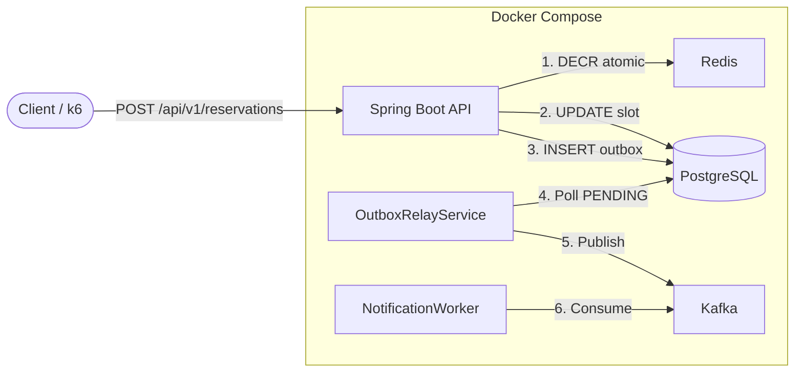
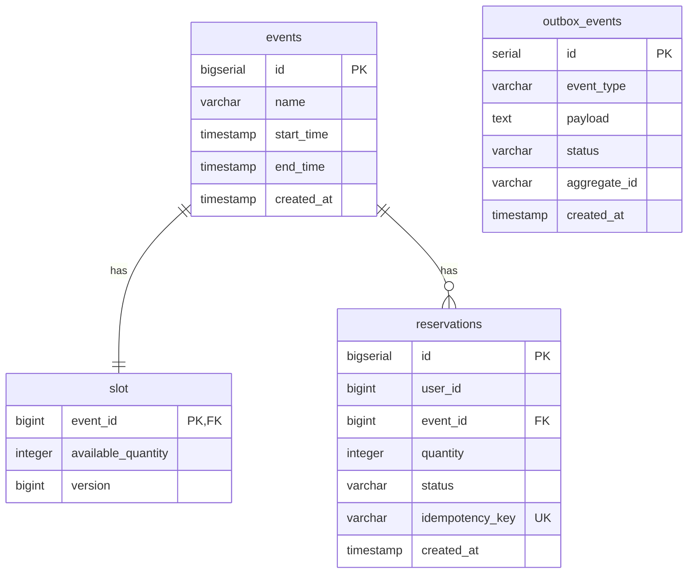

# BurstSlot - High-Concurrency Slot Reservation System

### 1. Project Definition

**BurstSlot** is a specialized backend system designed to solve high-concurrency resource allocation problem — scenarios where massive traffic spikes target extremely limited slots/resources within milliseconds.
Key goals are **Zero Overselling** and **High System Stability Under Peak Traffic Load**.

### 2. Architecture

The project is structured as a Minimum Viable Product (MVP) to focus entirely on concurrent state management. It runs in a self-contained environment using **Docker Compose** with the following technology stack:

- **API Server:** Spring Boot 3
- **Database:** PostgreSQL 16
- **Distributed Cache:** Redis 7
- **Message Broker:** Apache Kafka 3.7



### 3. Bootstrap & Setup

Start the infrastructure stack and application service:

```bash
docker compose up -d --build
```

Stop the services and clear database volumes (reset state):

```bash
docker compose down -v
```

### 4. Load Testing & Performance Verification

#### 4.1. k6 Load Testing Script

- **Definition:** The k6 load testing script is written in JavaScript, defining Virtual User (VU) behavior, load duration, headers, and payloads.
- **Strategy:** Each HTTP request is dynamically assigned a unique UUID in the HTTP headers as an `Idempotency-Key` to safely prevent duplicate orders and simulate unique transactional entries.

**Create the `loadtest.js` file in the root directory:**

```javascript
import http from "k6/http";
import { check } from "k6";
import { uuidv4 } from "https://jslib.k6.io/k6-utils/1.4.0/index.js";

export const options = {
  scenarios: {
    slot_grabbing_spike: {
      executor: "shared-iterations",
      vus: 1000,
      iterations: 100000,
      maxDuration: "30s",
    },
  },
};

export default function () {
  const url = "http://localhost:8080/api/v1/reservations";

  const payload = JSON.stringify({
    eventId: 1,
    quantity: 1,
  });

  const params = {
    headers: {
      "Content-Type": "application/json",
      "Idempotency-Key": uuidv4(),
      "X-User-Id": Math.floor(Math.random() * 100000) + 1,
    },
  };

  const response = http.post(url, payload, params);

  check(response, {
    "is status 200 or 409": (r) => r.status === 200 || r.status === 409,
    "is NOT status 500": (r) => r.status !== 500,
  });
}
```

**Install k6 (on Ubuntu/Debian):**

```bash
sudo gpg -k
sudo gpg --no-default-keyring --keyring /usr/share/keyrings/k6-archive-keyring.gpg --keyserver hkp://keyserver.ubuntu.com:80 --recv-keys C5AD17C747E3415A3642D57D77C6C491D6AC1D69
echo "deb [signed-by=/usr/share/keyrings/k6-archive-keyring.gpg] https://dl.k6.io/deb stable main" | sudo tee /etc/apt/sources.list.d/k6.list
sudo apt-get update
sudo apt-get install k6 -y
```

**Execute the load test:**

```bash
k6 run loadtest.js
```

#### 4.2. Verify Results

Run a direct SQL command in the running PostgreSQL container to check the reservation count:

```bash
docker exec burstslot-db-1 psql -U toan -d burstslot -c "SELECT COUNT(*) FROM reservations WHERE event_id = 1;"
```

---

### 5. Database Schema Design



#### 5.1. `events`

```sql
CREATE TABLE events (
    id BIGSERIAL PRIMARY KEY,
    name VARCHAR(255) NOT NULL,
    start_time TIMESTAMP WITH TIME ZONE NOT NULL,
    end_time TIMESTAMP WITH TIME ZONE NOT NULL,
    created_at TIMESTAMP WITH TIME ZONE DEFAULT CURRENT_TIMESTAMP
);
```

#### 5.2. `slot`

```sql
CREATE TABLE slot (
    event_id BIGINT PRIMARY KEY REFERENCES events(id),
    available_quantity INTEGER NOT NULL,
    version BIGINT NOT NULL DEFAULT 0,

    CONSTRAINT chk_positive_slot CHECK (available_quantity >= 0)
);

CREATE INDEX idx_slot_event_id ON slot(event_id);
```

#### 5.3. `reservations`

```sql
CREATE TABLE reservations (
    id BIGSERIAL PRIMARY KEY,
    user_id BIGINT NOT NULL,
    event_id BIGINT NOT NULL REFERENCES events(id),
    quantity INTEGER NOT NULL,
    status VARCHAR(50) NOT NULL,
    idempotency_key VARCHAR(255) UNIQUE NOT NULL,
    created_at TIMESTAMP WITH TIME ZONE DEFAULT CURRENT_TIMESTAMP
);

CREATE INDEX idx_reservations_user_event ON reservations(user_id, event_id);
CREATE INDEX idx_reservations_idempotency ON reservations(idempotency_key);
```

#### 5.4. `outbox_events`

```sql
CREATE TABLE IF NOT EXISTS outbox_events (
    id SERIAL PRIMARY KEY,
    event_type VARCHAR(255) NOT NULL,
    payload TEXT NOT NULL,
    status VARCHAR(50) NOT NULL,
    aggregate_id VARCHAR(255),
    created_at TIMESTAMP WITHOUT TIME ZONE DEFAULT NOW()
);
```
